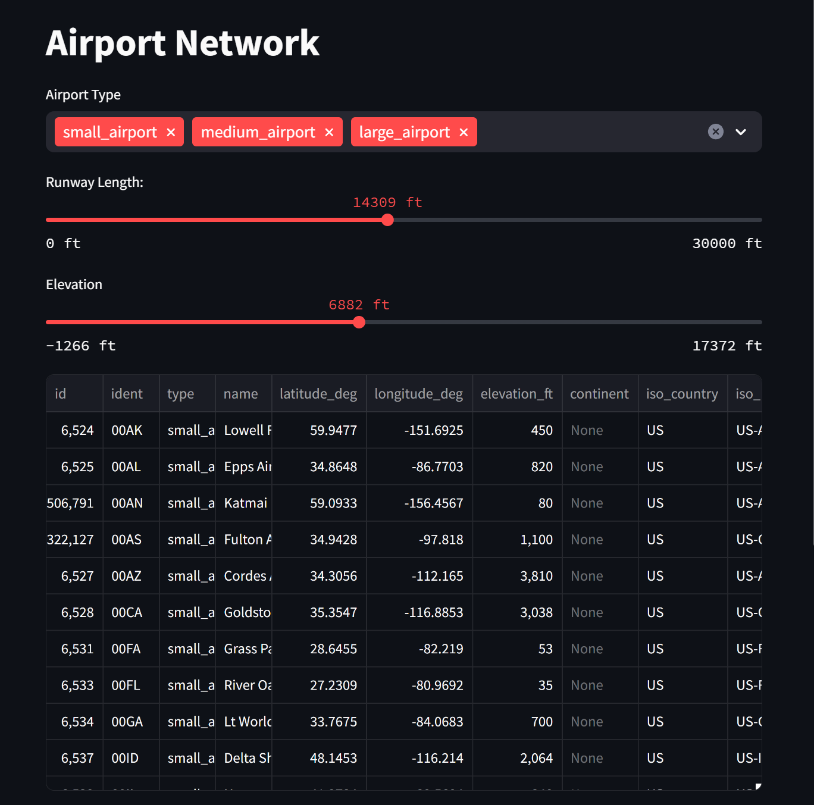

# Airport Dashboard

Basic airport dashboard that helps filtering and visualizing airport data.

## Data
All data is coming from [OurAirports.com](OurAirports.com)

## How to install (with [Rye](https://rye-up.com/))

- Clone the repository

```bash
git clone 
```
- Use Rye to setup a virtual environment

```bash
rye sync
```

- Activate the environemnt 

```bash
source ./venv/bin/activate
```

- Run streamlit

```bash
streamlit run airport-catchment/app.py
```


# Dashboard


